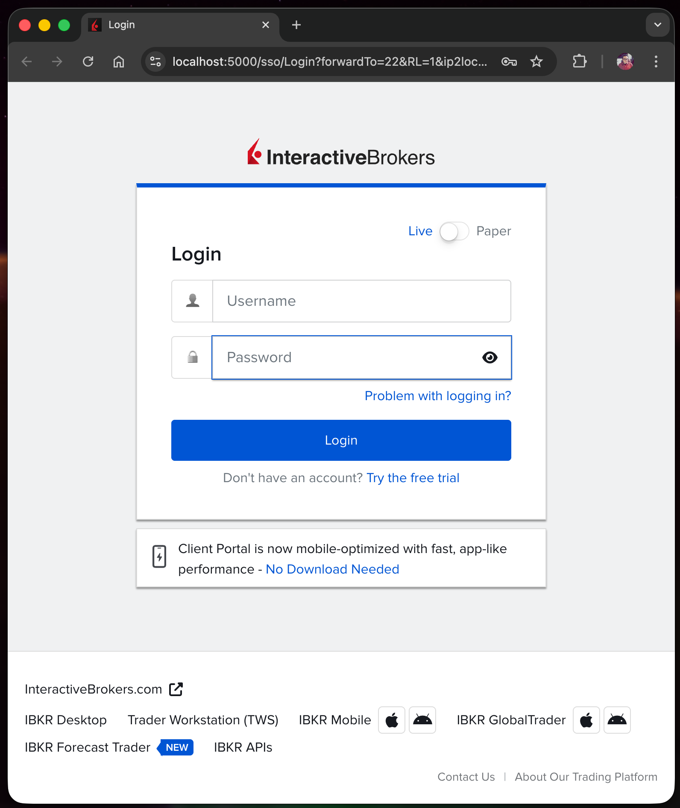
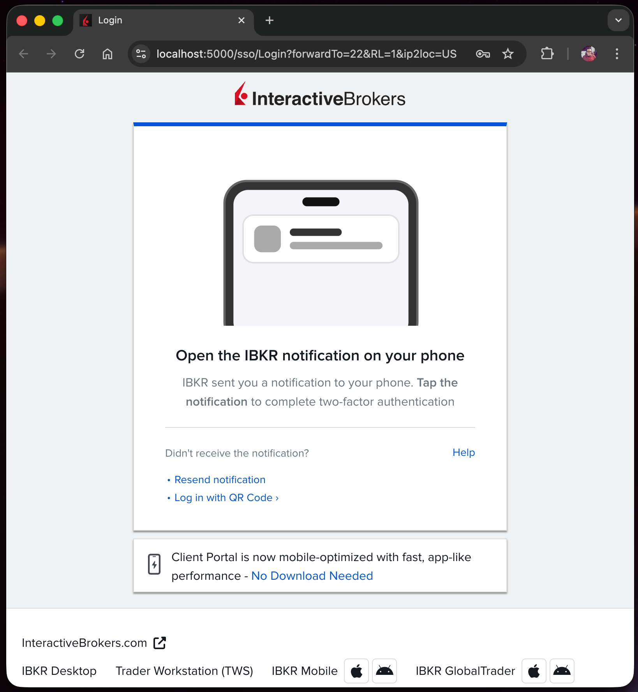

# speedboat

A small repo to help you get more out of your cross-border equity
compensation. The thesis is in
[ibkr_for_cross_border_equity_comp.md](ibkr_for_cross_border_equity_comp.md):
consolidate the shares at IBKR, where you can hold multi-currency
cash, convert FX cheaply, and pay euro out to your German bank
without paying retail FX spreads. (When you open an account as a
German resident, IBKR routes you to its EU entity automatically —
the seed doc has the regulatory picture.)

speedboat itself is small. Today it's a thesis, the operational
scripts to drive IBKR's Client Portal Gateway (the daemon you run
locally so the IBKR API is reachable from a Python script or a
coding agent), and a reference library on what the IBKR API does
well and where it falls short. There is no code here that touches
real money. There's no IBKR account yet either — when there is, the
scaffolding is ready.

## What's here

- A clear thesis on why IBKR is the right place to put the shares,
  and how the share transfer actually works
  ([seed doc](ibkr_for_cross_border_equity_comp.md)).
- Operational scripts and a screenshot-led walkthrough for IBKR's
  Client Portal Gateway, the one daemon you need to run for the API
  to work ([scripts/](scripts/), [docs/ibkr/spinup.md](docs/ibkr/spinup.md)).
- Background reading on the IBKR API itself — what it can do
  cleanly ([docs/ibkr/what-works.md](docs/ibkr/what-works.md)) and
  where it falls short
  ([docs/ibkr/what-doesnt.md](docs/ibkr/what-doesnt.md)).
- A reference corpus on agent and harness design — Anthropic and
  OpenAI primary sources, plus an applied synthesis
  ([docs/agentic-design/](docs/agentic-design/)). Useful for the
  agent to draw on, and (if you're into harness engineering)
  interesting prose in its own right.

## What an agent in this repo will find easy

- Read account positions, balances, today's P/L.
- Pull cash balances by currency, with USD-equivalents.
- Get free real-time market data for US-listed equities and ETFs
  (via the Cboe One + IEX feed that IBKR includes by default).
- Query free FX rates.
- Compute things from positions: allocation breakdowns,
  concentration, unrealized P/L by sector.
- Resolve tickers to IBKR's contract IDs (`conid`).

Full list at [docs/ibkr/what-works.md](docs/ibkr/what-works.md).

## What it'll find harder

- **Historical trades older than ~5–7 days.** The API basically
  doesn't return them. The workaround (manual Activity Statement
  CSV download) is documented, but is genuinely a manual step.
- **Universe scans, fundamentals across thousands of names, full
  options chains.** Doable but pacing-limited; better via a
  third-party data provider like Massive.
- **Anything requiring orders.** This repo is read-only by design.
  Order placement belongs in a separate, isolated repo if it ever
  happens.
- **Anything that needs to run unattended overnight.** The gateway
  needs a human to approve a phone push every ~24 h. Structural,
  not a config issue.

Full list at [docs/ibkr/what-doesnt.md](docs/ibkr/what-doesnt.md).

## Getting started

You'll need an IBKR account. The seed doc explains why and how to
open one. Once it exists:

1. **Fetch the gateway** — `./scripts/download_gateway.sh`. This
   downloads IBKR's Client Portal Gateway, regenerates its TLS
   certificate (the default ships with a hostname mismatch and
   expired in 2019), and trusts the new cert in your macOS login
   keychain so Chrome stops complaining.

2. **Bring it up** — `./scripts/spinup.sh`. Starts the gateway and
   opens the IBKR login page in Chrome. Type your username and
   password.

3. **The desktop tells you to look at your phone.** After you
   submit, the page transitions to a "look at your phone" prompt
   while it waits for the push approval.

4. **Approve the push on your phone.** Standard two-factor
   confirmation in IBKR's IB Key app — Face ID, Touch ID, or
   whatever phone unlock you have set up.

5. **You're authenticated.** The desktop transitions to the IBKR
   Client Portal landing page, and `spinup.sh` confirms in the
   terminal with a quick status check and your account ID. The
   API is now reachable at `https://localhost:5000/v1/api/...`.

6. **Point your coding agent at the repo and ask it what to build
   first.** It'll pick up `CLAUDE.md` and the `docs/` tree
   automatically — the IBKR domain knowledge in `docs/ibkr/` is
   its starter library, and `docs/agentic-design/` keeps the
   relevant essays close at hand. Works with any harness that
   reads `CLAUDE.md` (Claude Code, OpenCode, Cursor, etc.) — the
   repo is harness-agnostic.

The two desktop screens you'll see — login, then the prompt to
look at your phone:

  
  

When you're done, run `./scripts/teardown.sh` to log out cleanly.
(Skipping this step is fine but will make the next login a
challenge dialog rather than a clean push approval. The script
handles it for you.)

## Growing this repo

Two flavors of next step. The brokerage-feature ones produce useful
tooling; the agent-design ones are excuses to play with harness
engineering against a real, concrete domain.

### Brokerage features

- A read-only dashboard. Streamlit is the easiest path; positions
  + today's P/L + an allocation treemap is a complete first step
  and the agent has the IBKR knowledge to build it from scratch.
- Vest-event tracking — when shares from the Morgan Stanley side
  unlock and arrive at IBKR after a transfer.
- A USD→EUR FX-conversion helper that watches the rate and pings
  you when it hits a target you've set.
- Tax-lot accounting for German FIFO reporting. Sourced from the
  Activity Statement CSV (see
  [docs/ibkr/activity-statements.md](docs/ibkr/activity-statements.md)).

None of these need data beyond what IBKR gives free. None of them
require touching real money — they're all read-and-compute.

### Agent-design experiments

If you're into harness engineering, the IBKR API is a reasonable
playground — concrete, bounded, with cleanly mixed strengths and
gaps (see [docs/ibkr/what-works.md](docs/ibkr/what-works.md) and
[docs/ibkr/what-doesnt.md](docs/ibkr/what-doesnt.md)). A few things
worth trying:

- **Action-registry-driven IBKR client.** Build the client with an
  explicit action registry — name, inputs, validation, risk level,
  whether confirmation is required — instead of letting the agent
  call HTTP endpoints directly. Then see how well the agent stays
  on-contract without leaking endpoint detail into prompts. Pattern
  from
  [docs/agentic-design/borrowable-harness-patterns.md](docs/agentic-design/borrowable-harness-patterns.md).
- **Decision-artifact log for FX conversions.** Every time the
  agent suggests "convert now," persist the reasoning, the rate
  observed, the alternatives considered. Compare across decisions
  later. Same pattern, applied to a smaller surface.
- **Multi-source orchestrator.** Build the meta-layer that knows
  when to use IBKR (cheap, complete for "self" data) vs. when to
  reach for a third-party feed like Massive (better for "world"
  data — universe scans, fundamentals across thousands of names,
  full options chains). Persistent memory of which questions
  resolved cleanly via which source. This is the orchestrator
  shape your existing harness probably already has primitives for.

Each of these is small, reversible, and produces something you can
look at later.

## Conventions

The doc set is written for both human eyes and the coding agent
that will work alongside you. See
[docs/conventions.md](docs/conventions.md) for the full set —
short, just the things that aren't obvious from the code.

## License & ownership

Yours. Do whatever you want with it.
